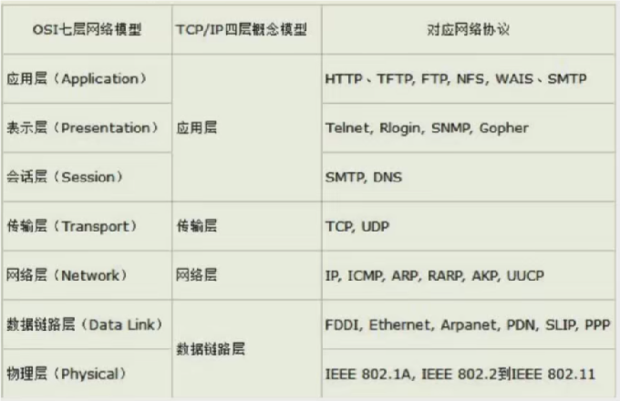
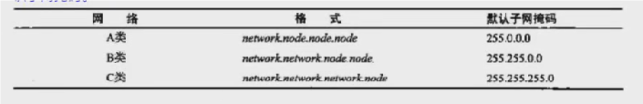

# 001_网络的概念与组成

## ISO7层模型与TCP/IP4层模型

### 网络层与传输层的主要区别是什么？

答：它们俩的分工不同。

网络层核心协议是IP协议，它的主要职责是“确定到主机地址的最佳路线”，就是不要走错了，走到别的ip上了，因此被称为“网络层”，其核心是IP协议。

传输层核心协议是TCP和UDP，其主要职责是“确保数据包的准确性”，比如TCP协议，确保可靠性。另外还有流量控制协议，将大块数据切割成小块的。因此被称为“传输层”，确保传输数据的准确性和流量控制。

现在你应该理解传输层和网络层，其之间的协议的区别了吧，很简单的，一点也不难。

## 网络的寻址

### 局域网的内部寻址

在局域网内部寻址，本身是不需要IP地址的，局域网内部寻址本身是通过MAC地址来进行通信的，只要知道对方的MAC地址，就来使用MAC地址进行通信。 

### 互联网寻址工作

其IP寻址，是网络层的工作；其MAC地址寻找，是数据链路层的工作。

当前主流的组网方式是大大小小的局域网通过交换机连接到互联网，交换机就是你所在的局域网的出入口。交换机维护了一个ARP表。

[网络寻址过程 ](https://www.cnblogs.com/hello-shf/p/13570587.html)

## 子网划分

