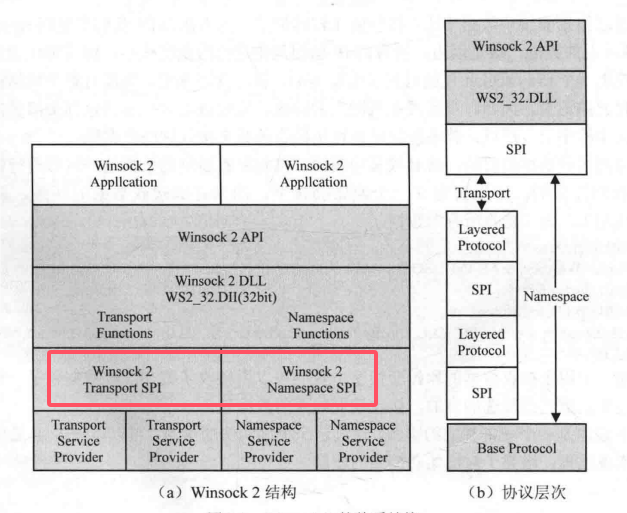
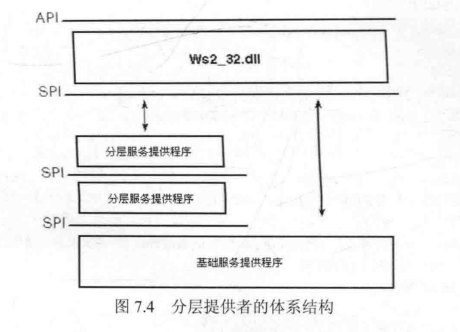
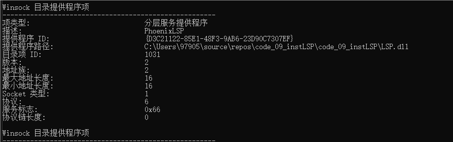

# LSP网络服务提供商

### 什么是 SPI

SPI的全程是 Service Provider Interface，服务提供者接口。其由两部分组成：传输服务提供者（Transport Service Provider） 和 命名空间服务提供者（Name Space Provider）。



### 什么是LSP

LSP的全称是Layered Service Provider，分层服务提供者。其属于TSP传输服务提供者的一种，其将自己安装到Winsock目录中的基础提供者上面，很可能在其他分层提供者之间。

简单来说就是将自己插入到TCP/IP协议栈中，以拦截和处理网络数据。其是应用层的处理，并不涉及内核层，有些直接调用驱动来进行网络通信的应用可能拦截不到。

### 如何列举出当前的协议

调用 `WSAEnumProtocols`函数。注意，该函数只能列举出Winsock协议栈中注册的协议，不会列举出非Winsock协议、内核模式协议、未注册的自定义协议和专有协议。

示例如下，可以看出`PhoenixLSP`协议在 `MSAFD` 协议之上。
```
Protocol: PhoenixLSP over MSAFD Tcpip [TCP/IP]
CatalogEntryId: 1032           ChainLen: 2

···

Protocol: MSAFD Tcpip [TCP/IP]
CatalogEntryId: 1003           ChainLen: 1

···
```

### LSP的运行原理

LSP本身是DLL，可以将其安装到winsock目录中，以便创建套接字的应用程序不必知道此就能LSP任何信息就能知道使用它。

用户创建套接字时，套接字创建函数(socket)会在Winsock目录中寻找合适的协议，然后调用此协议的提供者导出的函数完成各种功能。 

我们的目的是将自己编写的提供者LSP安装到WinSock目录中，让用户调用我们的服务提供者，再由我们的服务提供者调用下层提供者，这样一来，便可以截获所有Winsock调用了。



调用如下指令可以列出当前winsock目录中的内容

```
netsh winsock show catalog
```



### LSP代码安装过程

其代码在code_09_instLSP中已经实现。


其安装过程分为如下几个步骤：
1. 遍历协议，查找要被植入的 IPPROTO_UDP， IPPROTO_TCP， IPPROTO_IP 三个协议；
2. 安装自己的LSP；
3. 遍历协议，查找自己安装的LSP协议的dwCatalogEntryId；
4. 将（1）中找到的协议在自己的Chain中往后移动一位，第一位是LSP的dwCatalogEntryId；
5. 将（4）中修改好的协议重新安装一遍；
6. 调用WSCWriteProviderOrder函数，将dwCatalogEntryId重新排序一便，使之生效。

### LSP代码的编写过程

其代码在code_09_instLSP中已经实现。

其实现LSP实现需要导出一个函数`WSPStartup`；

WSPStartup调用时机：当一个应用程序或系统组件调用 WSAStartup 以初始化Winsock库时，Winsock库会加载所有已安装的协议服务提供者。在此过程中，Winsock库会调用每个服务提供者的 WSPStartup 函数来初始化服务提供者。


其核心代码分为以下几个步骤：
1. 获取下层提供者者的WSPStartup函数，并且调用来进行初始化；
2. 替换lpProcTable表中的lpWSPSendTo函数，实现数据拦截。


